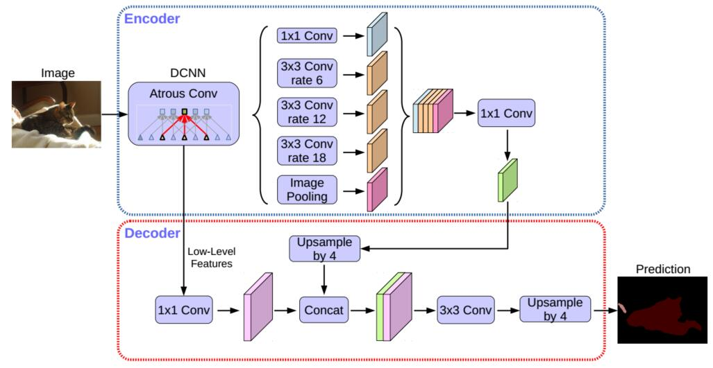
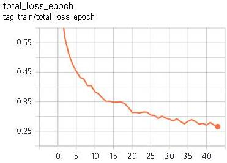
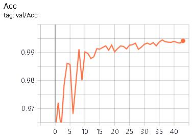
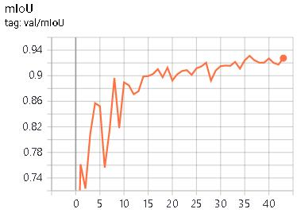
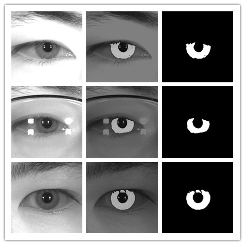
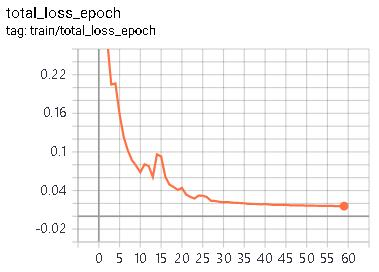
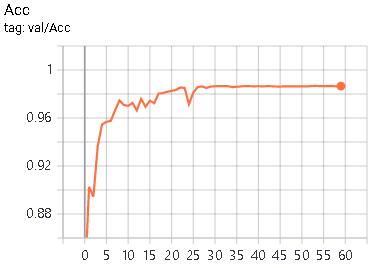
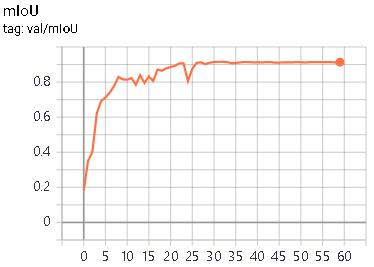
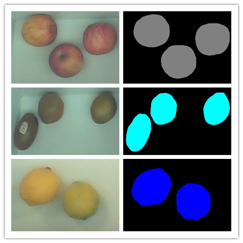
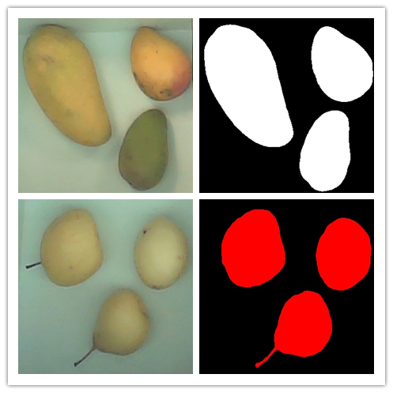

# deeplabv3plus_pytorch

基于deeplabv3plus网络实现了虹膜图像分割以及水果图像分割

### 原理
deeplabv3+包含三部分backbone、ASPP以及Decoder三部分。backbone获取一个低层次特征和一个高层次特征，然后将高层次特征输入到ASPP得到多尺度特征，再对多尺度特征上采样与低层次特征融合得到包含语义特征和细粒度特征的融合特征，最后对融合特征上采样，得到mask。

### 虹膜图像分割

#### 训练过程

#### 测试结果

#### 相关数据集
[IrisParseNet](https://github.com/xiamenwcy/IrisParseNet)

### 水果图像分割

#### 训练过程

#### 测试结果

#### 相关数据集
[Fruit-Images-Dataset](https://github.com/Horea94/Fruit-Images-Dataset)

## 致谢
[pytorch-deeplab-xception](https://github.com/jfzhang95/pytorch-deeplab-xception)

感谢王博士提供的虹膜图像分割数据[IrisParseNet](https://github.com/xiamenwcy/IrisParseNet)
